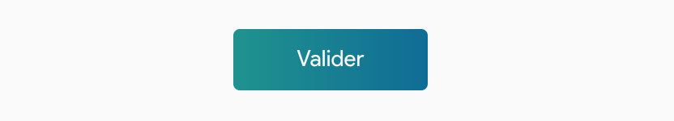

# Description of component

CustomButton communicate actions that users can take. They are typically placed throughout your UI, in places like:

* Dialogs
* Modal windows
* Forms
* Cards
* Toolbars

#### Example :



## How to import

```node
import { CustomButton } from "app/shared/components/CustomButton";
```

## How to use

```node
....
    <CustomButton>Valider</CustomButton>
....
```

## Props

| Props       | Required | Description | Type |
| :---        | :---     | :---        |:---  |
| `children` | true | The content of the button. | `node` |
| `color` | false | Allows you to define the foreground color of a text element and its possible decorations. | `string` |
| `background` | false | Allows you to define the different values of the properties related to the management of the backgrounds of an element (color, image, origin, size, repetition, etc. | `string` |
| `borderRadius` | false | Allows you to define rounded corners for the border of an element. | `string` or `number` |
| `border` | false | Allows you to define the properties related to the border. | `string` or `number` |
| `height` | false | Allows you to set the height of the content box of an element. | `string` or `number` |
| `width` | false | Allows you to define the width of the content box of an element. | `string` or `number` |
| `padding` | false | Allows you to define the different filling distances on the four sides of an element. | `string` or `number` |
| `margin` | false | Sets the size of the margins on all four sides of the element. | `string` or `number` |
| `textTransform` | false | Defines how to use capital letters for the text of an element. | `'lowercase'` or `'capitalize'` or `'none'` or `'uppercase'` |
| `minWidth` | false | The min-width property is used to define the minimum width of a given element. | `string` or `number` |

## CSS properties we can override

You can override all CSS properties of the ButtonProps type of Material UI.
