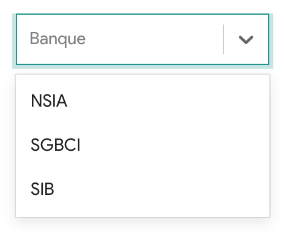

# Description of component

contains as few styles as possible. It aims to be a simple building block for creating an input. It contains a load of
style reset and some state logic.

#### Example :



## How to import

```node
import CustomSelect from "app/shared/components/CustomSelect";
```

## How to use

```node
<FormControl variant="outlined" size="medium">
  <Field
    as="select"
    name="countryId"
    component={CustomSelect} // <-- here
    placeholder="Pays"
    options={Countries}
    value={values.countryId}
    disabled={isEditing && isFetching}
  />
</FormControl>
```

## Props

All others React Select props

## CSS properties we can override

You can override all CSS properties of the React Select.
