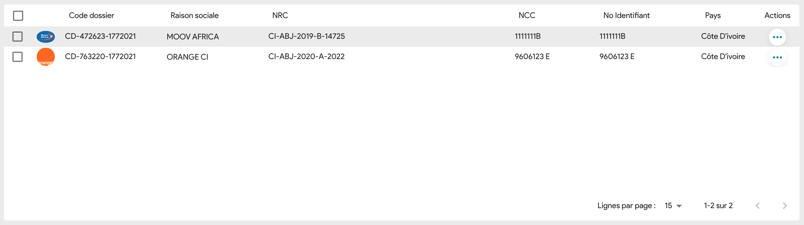

# Description of component

Data tables display information in a grid-like format of rows and columns. They organize information in a way that’s
easy to scan so that users can look for patterns and insights.

The component leverages the power of React and TypeScript, to provide the best UX while manipulating an unlimited set of
data. It comes with an intuitive API for real-time updates, accessibility, as well as theming and custom templates, all
with blazing fast performance.

#### Example :



## How to import

```node
import { DataTable } from "app/shared/components/DataTable";
```

## How to use

```node
<TableContainer component={Paper} elevation={0} style={{ height: "38rem" }}>
  <DataTable
    columns={columnsAccountingPlan}
    rows={data}
    loading={isLoading}
    checkboxSelection
    disableSelectionOnClick
    density="compact"
    disableColumnMenu
    rowsPerPageOptions={[20, 50, 100]}
    pageSize={20}
    components={{
      LoadingOverlay: CustomLoadingOverlay,
    }}
    localeText={{
      errorOverlayDefaultLabel: "Une erreur s'est produite.",
      noRowsLabel: "Aucun résultat trouvé.",
      toolbarDensity: "Compact",
    }}
    hideFooterSelectedRowCount={true}
  />
</TableContainer>
```

## Props

All others DataGrid Community props

## CSS properties we can override

You can override all CSS properties of the DataGrid Community type of Material UI.
