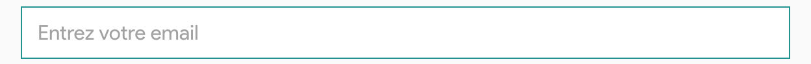

# Description of component

contains as few styles as possible. It aims to be a simple building block for creating an input. It contains a load of
style reset and some state logic.

#### Example :



## How to import

```node
import { FieldSet } from "app/shared/components/FieldSet";
```

## How to use

```node
<Formik>
  {({ handleChange }) => (
    ....
      <FieldSet
        type="email"
        name="email"
        onChange={handleChange}
        placeholder="Entrez votre email"
      />
    ....
  )}
<Formik />
```

## Props

All others InputBase props

## CSS properties we can override

You can override all CSS properties of the InputBaseProps type of Material UI.
