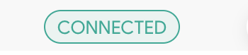

# Description of component

StatusChip is an element that represents an input, an attribute or an action.

#### Example :



## How to import

```node
import { StatusChip } from "app/shared/components/StatusChip";
```

## How to use

````node
....
    <StatusChip size="small" label="CONNECTED" variant="outlined" />
....
````

## Props

| Props | Required | Description | Type |
| :---- | :------- | :---------- | :--- |
| `children` | true | The content of the button. | `node` |
| `color` | false | Allows you to define the foreground color of a text element and its possible decorations. | `string` |
| `label` | false | The content of the label. | `node` |
| `background` | false | Allows you to define the different values of the properties related to the management of the backgrounds of an element (color, image, origin, size, repetition, etc. | `string` |

## CSS properties we can override

You can override all CSS properties of the ChipProps type of Material UI.
